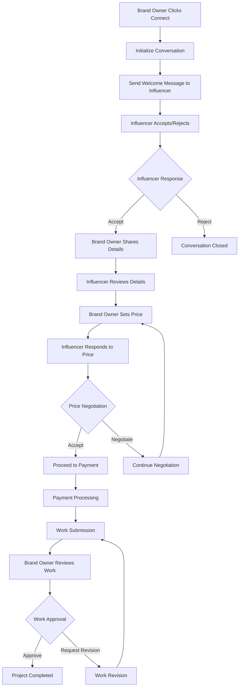
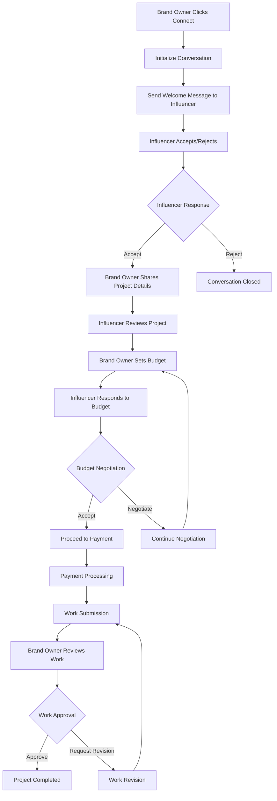

# 🤖 Complete Automated Chat Flow Guide

## 📋 Overview

This comprehensive guide covers the entire automated chat flow system for bids, campaigns, and direct conversations. The system uses a state machine approach to guide users through structured conversations from initial connection to project completion.

---

## 🏗️ System Architecture

### **Core Components**
- **AutomatedFlowService** - Main state machine and flow logic
- **Conversation States** - Tracks current stage of conversation
- **Message Types** - Different types of automated messages
- **Action Handlers** - Process user actions and state transitions
- **Notification System** - Real-time updates and push notifications

### **Database Tables**
- **conversations** - Stores conversation state and metadata
- **messages** - Stores all messages with action data
- **requests** - Links conversations to bids/campaigns
- **notifications** - Real-time notification system

---

## 🎯 CONVERSATION TYPES

### **1. Bid-Based Conversations**
- **Trigger**: Brand owner clicks "Connect" on a bid request
- **Flow**: Price negotiation → Payment → Work submission → Completion
- **Key Features**: Proposal amount handling, price negotiation, payment processing

### **2. Campaign-Based Conversations**
- **Trigger**: Brand owner clicks "Connect" on a campaign request
- **Flow**: Project details → Pricing → Payment → Work submission → Completion
- **Key Features**: Project specification, budget negotiation, campaign management

### **3. Direct Conversations**
- **Trigger**: Direct messaging between users
- **Flow**: Simple chat without structured workflow
- **Key Features**: Real-time messaging, no automated flow

---

## 🔄 FLOW STATES & TRANSITIONS

### **Initial States**
```typescript
// Bid Conversations
flow_state: "influencer_responding"
awaiting_role: "influencer"

// Campaign Conversations  
flow_state: "influencer_responding"
awaiting_role: "influencer"

// Direct Conversations
flow_state: "real_time"
awaiting_role: null
```

### **Complete State Machine**

#### **1. Connection Phase**
- `influencer_responding` → Influencer accepts/rejects connection
- `brand_owner_details` → Brand owner provides project details
- `influencer_project_response` → Influencer reviews project details

#### **2. Pricing Phase**
- `brand_owner_pricing` → Brand owner sets initial price
- `influencer_price_response` → Influencer responds to price
- `brand_owner_negotiation` → Brand owner negotiates price
- `influencer_final_response` → Influencer final price decision

#### **3. Payment Phase**
- `payment_pending` → Payment processing
- `payment_completed` → Payment verified

#### **4. Work Phase**
- `work_submitted` → Influencer submits work
- `work_approved` → Brand owner approves work
- `work_revision_requested` → Brand owner requests revisions

#### **5. Completion Phase**
- `work_approved` → Project completed successfully
- `chat_closed` → Conversation ended
- `collaboration_cancelled` → Project cancelled

---

## 🚀 CONVERSATION INITIALIZATION

### **Bid Conversation Initialization**

#### **API Endpoint**
```http
POST /api/bids/initialize-conversation
Content-Type: application/json
Authorization: Bearer <brand_owner_token>

{
  "bid_id": "uuid",
  "influencer_id": "uuid", 
  "proposed_amount": 500
}
```

#### **Flow Process**
1. **Validation**: Verify brand owner owns the bid
2. **Request Lookup**: Find existing request with proposal amount
3. **Conversation Creation**: Create conversation with initial state
4. **Message Creation**: Send automated welcome message to influencer
5. **Notification**: Notify influencer of new conversation

#### **Initial Message**
```typescript
{
  message: "🎯 **Bid Connection Request**\n\nHi [Influencer]! You've been invited to collaborate on the bid \"[Bid Title]\".\n\n**Bid Details:**\n- Budget: ₹[min] - ₹[max]\n- Requirements: [requirements]\n- Platform: [platform]\n\nWould you like to accept this collaboration?",
  message_type: "automated",
  action_required: true,
  action_data: {
    title: "Bid Collaboration",
    buttons: [
      { id: "accept", text: "Accept Bid", action: "accept", style: "success" },
      { id: "reject", text: "Decline Bid", action: "reject", style: "danger" }
    ]
  }
}
```

### **Campaign Conversation Initialization**

#### **API Endpoint**
```http
POST /api/campaigns/initialize-conversation
Content-Type: application/json
Authorization: Bearer <brand_owner_token>

{
  "campaign_id": "uuid",
  "influencer_id": "uuid"
}
```

#### **Flow Process**
1. **Validation**: Verify brand owner owns the campaign
2. **Request Lookup**: Find existing request
3. **Conversation Creation**: Create conversation with initial state
4. **Message Creation**: Send automated welcome message
5. **Notification**: Notify influencer

#### **Initial Message**
```typescript
{
  message: "🎯 **Campaign Connection Request**\n\nHi [Influencer]! You've been invited to collaborate on the campaign \"[Campaign Title]\".\n\n**Campaign Details:**\n- Budget: ₹[min] - ₹[max]\n- Type: [type]\n- Platform: [platform]\n- Requirements: [requirements]\n\nWould you like to accept this collaboration?",
  message_type: "automated",
  action_required: true,
  action_data: {
    title: "Campaign Collaboration",
    buttons: [
      { id: "accept", text: "Accept Campaign", action: "accept", style: "success" },
      { id: "reject", text: "Decline Campaign", action: "reject", style: "danger" }
    ]
  }
}
```

---

## 🎮 ACTION HANDLERS

### **Influencer Actions**

#### **1. Accept Connection**
```typescript
// Action: "accept"
// New State: "brand_owner_details"
// Awaiting: "brand_owner"

{
  message: "Great! I'm interested in this project. Please share the details.",
  message_type: "system",
  is_automated: true
}
```

#### **2. Reject Connection**
```typescript
// Action: "reject"
// New State: "collaboration_cancelled"
// Awaiting: null

{
  message: "Thank you for considering me, but I'm not available for this project.",
  message_type: "system",
  is_automated: true
}
```

#### **3. Accept Project Details**
```typescript
// Action: "accept_project"
// New State: "influencer_price_response"
// Awaiting: "influencer"

{
  message: "The project details look good! What's your budget for this?",
  message_type: "system",
  is_automated: true
}
```

#### **4. Accept Price**
```typescript
// Action: "accept_price"
// New State: "payment_pending"
// Awaiting: "brand_owner"

// Updates request with final agreed amount
// Creates payment order
// Sends payment instructions
```

#### **5. Negotiate Price**
```typescript
// Action: "negotiate_price"
// New State: "brand_owner_negotiation"
// Awaiting: "brand_owner"

{
  message: "I'd like to negotiate the price. What's your best offer?",
  message_type: "system",
  is_automated: true
}
```

#### **6. Submit Work**
```typescript
// Action: "submit_work"
// New State: "work_submitted"
// Awaiting: "brand_owner"

// Stores work submission data
// Sends notification to brand owner
// Enables work review interface
```

### **Brand Owner Actions**

#### **1. Send Project Details**
```typescript
// Action: "send_project_details"
// New State: "influencer_reviewing"
// Awaiting: "influencer"

{
  message: "Here are the project details: [details]",
  message_type: "user_input",
  is_automated: false
}
```

#### **2. Send Price Offer**
```typescript
// Action: "send_price_offer"
// New State: "influencer_price_response"
// Awaiting: "influencer"

{
  message: "I'm offering ₹[amount] for this project. What do you think?",
  message_type: "user_input",
  is_automated: false
}
```

#### **3. Proceed to Payment**
```typescript
// Action: "proceed_to_payment"
// New State: "payment_pending"
// Awaiting: "brand_owner"

// Creates payment order
// Updates request status
// Sends payment instructions
```

#### **4. Approve Work**
```typescript
// Action: "approve_work"
// New State: "work_approved"
// Awaiting: null

// Releases payment to influencer
// Marks project as completed
// Sends completion notification
```

#### **5. Request Revision**
```typescript
// Action: "request_revision"
// New State: "work_revision_requested"
// Awaiting: "influencer"

{
  message: "I need some revisions: [revision_notes]",
  message_type: "user_input",
  is_automated: false
}
```

---

## 💬 MESSAGE TYPES

### **Automated Messages**
- **System Messages**: Flow state transitions
- **Action Messages**: Require user response with buttons
- **Notification Messages**: Status updates and alerts

### **User Messages**
- **User Input**: Regular chat messages
- **Action Responses**: Responses to automated prompts
- **File Uploads**: Work submissions and media

### **Message Structure**
```typescript
interface Message {
  id: string;
  conversation_id: string;
  sender_id: string;
  receiver_id: string;
  message: string;
  message_type: 'user_input' | 'automated' | 'system';
  is_automated: boolean;
  action_required: boolean;
  action_data?: {
    title: string;
    subtitle?: string;
    buttons: ActionButton[];
  };
  media_url?: string;
  created_at: string;
}
```

---

## 🔔 NOTIFICATION SYSTEM

### **Real-time Notifications**
- **Socket Events**: Instant updates via WebSocket
- **Push Notifications**: Mobile app notifications
- **Email Notifications**: Important state changes

### **Notification Types**
- **Message Notifications**: New messages in conversation
- **State Change Notifications**: Flow state transitions
- **Action Required Notifications**: Pending user actions
- **Payment Notifications**: Payment status updates

### **Notification Payload**
```typescript
interface Notification {
  id: string;
  user_id: string;
  type: 'message' | 'conversation_update' | 'payment' | 'action_required';
  title: string;
  message: string;
  data: {
    conversation_id: string;
    message_id?: string;
    flow_state?: string;
    action_required?: boolean;
  };
  priority: 'low' | 'medium' | 'high';
  created_at: string;
}
```

---

## 🎯 API ENDPOINTS

### **Conversation Initialization**

#### **Bid Conversation**
```http
POST /api/bids/initialize-conversation
POST /api/bids/brand-owner-action
POST /api/bids/influencer-action
```

#### **Campaign Conversation**
```http
POST /api/campaigns/initialize-conversation
POST /api/campaigns/brand-owner-action
POST /api/campaigns/influencer-action
```

#### **Direct Conversation**
```http
POST /api/conversations/direct
POST /api/conversations/send-message
```

### **Action Endpoints**

#### **Brand Owner Actions**
```http
POST /api/bids/brand-owner-action
{
  "conversation_id": "uuid",
  "action": "send_project_details",
  "data": {
    "project_details": "Detailed project requirements...",
    "timeline": "2 weeks",
    "deliverables": ["Video", "Images", "Copy"]
  }
}
```

#### **Influencer Actions**
```http
POST /api/bids/influencer-action
{
  "conversation_id": "uuid",
  "action": "accept_price",
  "data": {
    "price": 500
  }
}
```

---

## 🔄 COMPLETE FLOW EXAMPLES

### **Bid Conversation Flow**



### **Campaign Conversation Flow**



---

## 🛠️ IMPLEMENTATION DETAILS

### **State Machine Logic**
```typescript
class AutomatedFlowService {
  async handleBrandOwnerAction(conversationId, action, data) {
    // Get current conversation state
    // Validate action is allowed in current state
    // Execute action logic
    // Update conversation state
    // Create automated message
    // Send notifications
    // Return updated state
  }

  async handleInfluencerAction(conversationId, action, data) {
    // Similar logic for influencer actions
  }
}
```

### **Database Updates**
```sql
-- Update conversation state
UPDATE conversations 
SET 
  flow_state = 'new_state',
  awaiting_role = 'new_role',
  flow_data = jsonb_set(flow_data, '{key}', 'value'),
  updated_at = NOW()
WHERE id = conversation_id;

-- Create automated message
INSERT INTO messages (
  conversation_id, sender_id, receiver_id, 
  message, message_type, is_automated, action_required, action_data
) VALUES (...);
```

### **Error Handling**
- **Validation Errors**: Invalid actions for current state
- **Permission Errors**: User not authorized for action
- **Database Errors**: Failed state updates
- **Notification Errors**: Failed real-time updates

---

## 🚀 FRONTEND INTEGRATION

### **Real-time Updates**
```javascript
// Listen for conversation updates
socket.on('conversation_update', (data) => {
  updateConversationState(data.flow_state);
  updateAwaitingRole(data.awaiting_role);
  addMessage(data.message);
});

// Listen for new messages
socket.on('new_message', (data) => {
  addMessage(data.message);
  if (data.message.action_required) {
    showActionButtons(data.message.action_data.buttons);
  }
});
```

### **Action Handling**
```javascript
// Send action to backend
async function sendAction(conversationId, action, data) {
  const response = await fetch('/api/bids/influencer-action', {
    method: 'POST',
    headers: { 'Content-Type': 'application/json' },
    body: JSON.stringify({
      conversation_id: conversationId,
      action: action,
      data: data
    })
  });
  
  const result = await response.json();
  if (result.success) {
    updateConversationState(result.flow_state);
  }
}
```

---

## 📊 MONITORING & ANALYTICS

### **Key Metrics**
- **Conversion Rates**: Connection acceptance rates
- **Time to Completion**: Average project duration
- **Payment Success**: Payment completion rates
- **User Satisfaction**: Work approval rates

### **Flow Analytics**
- **State Transitions**: Track user journey through states
- **Drop-off Points**: Identify where users leave the flow
- **Action Success Rates**: Measure action completion rates
- **Error Rates**: Track and monitor system errors

---

## 🎯 SUMMARY

The automated chat flow system provides a structured, guided experience for:

1. **Bid Collaborations**: Price-focused negotiations
2. **Campaign Collaborations**: Project-based workflows  
3. **Direct Conversations**: Free-form messaging

**Key Features:**
- ✅ State machine-driven flow control
- ✅ Real-time notifications and updates
- ✅ Action-based user interactions
- ✅ Automated message generation
- ✅ Payment integration
- ✅ Work submission and review
- ✅ Comprehensive error handling

**Result**: A complete, automated conversation system that guides users from initial connection to project completion! 🎉
