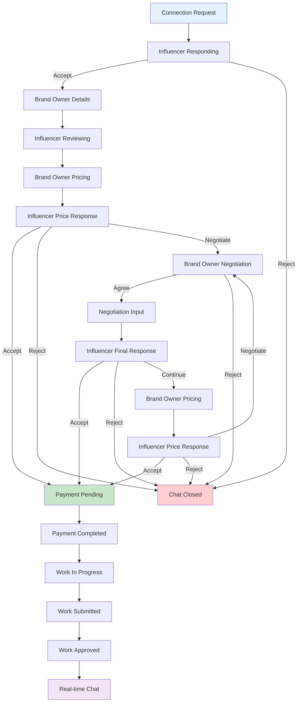
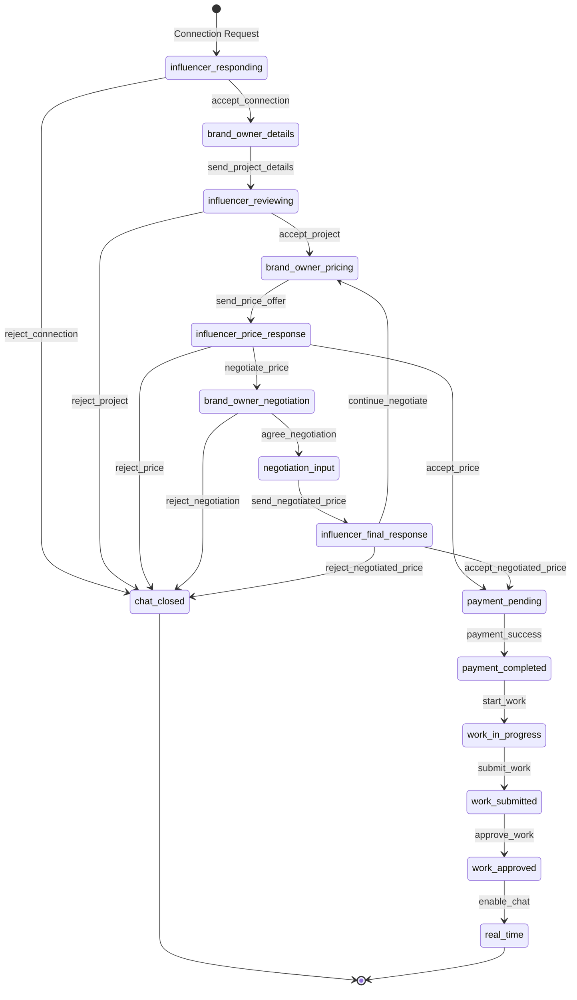
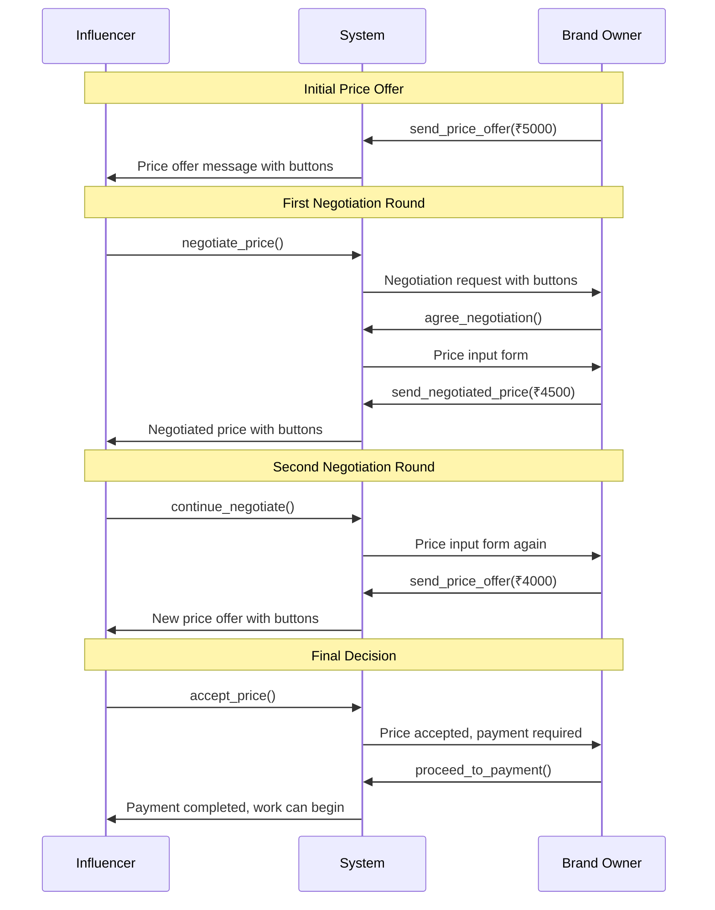

# Complete Negotiation Flow Guide

## 🎯 Overview

The negotiation flow is a sophisticated automated system that handles price negotiations between brand owners and influencers. It includes multi-round negotiations, real-time updates, and comprehensive state management.

## 🔄 Complete Negotiation Flow Diagram



## 📊 Detailed State Machine



## 🎮 Flow States & Actions

### 1. Initial States

| State | Awaiting Role | Description | Available Actions |
|-------|---------------|-------------|-------------------|
| `influencer_responding` | `influencer` | Influencer needs to respond to connection request | `accept_connection`, `reject_connection` |
| `brand_owner_details` | `brand_owner` | Brand owner needs to provide project details | `send_project_details` |
| `influencer_reviewing` | `influencer` | Influencer reviewing project requirements | `accept_project`, `reject_project` |
| `brand_owner_pricing` | `brand_owner` | Brand owner needs to set price offer | `send_price_offer` |

### 2. Negotiation States

| State | Awaiting Role | Description | Available Actions |
|-------|---------------|-------------|-------------------|
| `influencer_price_response` | `influencer` | Influencer responding to price offer | `accept_price`, `reject_price`, `negotiate_price` |
| `brand_owner_negotiation` | `brand_owner` | Brand owner handling negotiation request | `agree_negotiation`, `reject_negotiation` |
| `negotiation_input` | `brand_owner` | Brand owner entering new price offer | `send_negotiated_price` |
| `influencer_final_response` | `influencer` | Influencer making final decision | `accept_negotiated_price`, `reject_negotiated_price`, `continue_negotiate` |

### 3. Payment & Work States

| State | Awaiting Role | Description | Available Actions |
|-------|---------------|-------------|-------------------|
| `payment_pending` | `brand_owner` | Payment required from brand owner | `proceed_to_payment` |
| `payment_completed` | `influencer` | Payment completed, work can begin | `start_work` |
| `work_in_progress` | `influencer` | Work is in progress | `submit_work` |
| `work_submitted` | `brand_owner` | Work submitted for review | `approve_work`, `request_revision` |
| `work_approved` | `system` | Work approved, escrow released | `enable_chat` |

## 🔄 Multi-Round Negotiation Sequence



## 🛠️ API Endpoints

### 1. Handle Brand Owner Actions

```javascript
// POST /api/bids/automated/brand-owner-action
const handleBrandOwnerAction = async (conversationId, action, data = {}) => {
  const response = await fetch('/api/bids/automated/brand-owner-action', {
    method: 'POST',
    headers: {
      'Content-Type': 'application/json',
      'Authorization': `Bearer ${token}`
    },
    body: JSON.stringify({
      conversation_id: conversationId,
      action: action,
      data: data
    })
  });
  
  return await response.json();
};
```

### 2. Handle Influencer Actions

```javascript
// POST /api/bids/automated/influencer-action
const handleInfluencerAction = async (conversationId, action, data = {}) => {
  const response = await fetch('/api/bids/automated/influencer-action', {
    method: 'POST',
    headers: {
      'Content-Type': 'application/json',
      'Authorization': `Bearer ${token}`
    },
    body: JSON.stringify({
      conversation_id: conversationId,
      action: action,
      data: data
    })
  });
  
  return await response.json();
};
```

### 3. Get Conversation Context

```javascript
// GET /api/bids/automated/conversation/:conversation_id/context
const getConversationContext = async (conversationId) => {
  const response = await fetch(`/api/bids/automated/conversation/${conversationId}/context`, {
    headers: {
      'Authorization': `Bearer ${token}`
    }
  });
  
  return await response.json();
};
```

## 🔌 WebSocket Events

### Real-time Updates

```javascript
// Connect to WebSocket
const socket = io('ws://your-backend-url', {
  auth: { token: userToken }
});

// Listen for conversation updates
socket.on('conversation_updated', (data) => {
  console.log('Conversation updated:', data);
  updateConversationUI(data);
});

// Listen for new messages
socket.on('new_message', (data) => {
  console.log('New message:', data);
  addMessageToChat(data.message);
});

// Listen for flow state changes
socket.on('flow_state_changed', (data) => {
  console.log('Flow state changed:', data);
  updateFlowState(data);
});

// Join conversation room
socket.emit('join_conversation', { conversation_id: conversationId });
```

## 🎨 UI Components

### 1. Action Button Component

```javascript
const ActionButton = ({ button, onAction, disabled = false }) => {
  const handleClick = () => {
    if (button.action === 'handle_negotiation') {
      onAction(button.action, button.data);
    } else {
      onAction(button.action, button.data);
    }
  };

  return (
    <button
      onClick={handleClick}
      disabled={disabled}
      className={`action-button ${button.style}`}
    >
      {button.text}
    </button>
  );
};
```

### 2. Price Input Component

```javascript
const PriceInputForm = ({ onSubmit, onCancel, currentPrice = 0 }) => {
  const [price, setPrice] = useState(currentPrice);
  const [isSubmitting, setIsSubmitting] = useState(false);

  const handleSubmit = async (e) => {
    e.preventDefault();
    setIsSubmitting(true);
    
    try {
      await onSubmit(price);
    } catch (error) {
      console.error('Error submitting price:', error);
    } finally {
      setIsSubmitting(false);
    }
  };

  return (
    <form onSubmit={handleSubmit} className="price-input-form">
      <div className="form-group">
        <label htmlFor="price">Enter your price offer (₹)</label>
        <input
          type="number"
          id="price"
          value={price}
          onChange={(e) => setPrice(parseFloat(e.target.value))}
          min="0"
          step="0.01"
          required
        />
      </div>
      
      <div className="form-actions">
        <button type="submit" disabled={isSubmitting} className="btn-primary">
          {isSubmitting ? 'Sending...' : 'Send Offer'}
        </button>
        <button type="button" onClick={onCancel} className="btn-secondary">
          Cancel
        </button>
      </div>
    </form>
  );
};
```

### 3. Negotiation History Component

```javascript
const NegotiationHistory = ({ history = [] }) => {
  return (
    <div className="negotiation-history">
      <h3>Negotiation History</h3>
      {history.map((entry, index) => (
        <div key={index} className="negotiation-entry">
          <div className="entry-header">
            <span className="role">{entry.role}</span>
            <span className="timestamp">{entry.timestamp}</span>
          </div>
          <div className="entry-content">
            <div className="price">₹{entry.price}</div>
            <div className="message">{entry.message}</div>
          </div>
        </div>
      ))}
    </div>
  );
};
```

## 🔄 State Management

### Conversation Manager

```javascript
class ConversationManager {
  constructor(conversationId) {
    this.conversationId = conversationId;
    this.state = {
      flow_state: null,
      awaiting_role: null,
      chat_status: 'automated',
      payment_completed: false,
      messages: [],
      negotiation_history: []
    };
  }

  updateState(newState) {
    this.state = { ...this.state, ...newState };
    this.render();
  }

  render() {
    this.updateFlowState();
    this.updateAwaitingRole();
    this.updateActionButtons();
    this.updateNegotiationHistory();
  }

  updateFlowState() {
    const flowStateElement = document.getElementById('flow-state');
    if (flowStateElement) {
      flowStateElement.textContent = this.state.flow_state;
    }
  }

  updateAwaitingRole() {
    const awaitingRoleElement = document.getElementById('awaiting-role');
    if (awaitingRoleElement) {
      awaitingRoleElement.textContent = this.state.awaiting_role || 'None';
    }
  }

  updateActionButtons() {
    const actionContainer = document.getElementById('action-buttons');
    if (actionContainer) {
      const actions = this.getAvailableActions(this.state.flow_state, this.state.awaiting_role);
      actionContainer.innerHTML = actions.map(action => 
        `<button class="action-button ${action.style}" data-action="${action.action}">
          ${action.text}
        </button>`
      ).join('');
    }
  }

  getAvailableActions(flowState, role) {
    const actionMap = {
      'influencer_responding': role === 'influencer' ? [
        { text: 'Accept Connection', action: 'accept_connection', style: 'primary' },
        { text: 'Reject Connection', action: 'reject_connection', style: 'danger' }
      ] : [],
      
      'brand_owner_details': role === 'brand_owner' ? [
        { text: 'Send Project Details', action: 'send_project_details', style: 'primary' }
      ] : [],
      
      'influencer_price_response': role === 'influencer' ? [
        { text: 'Accept Price', action: 'accept_price', style: 'primary' },
        { text: 'Reject Price', action: 'reject_price', style: 'danger' },
        { text: 'Negotiate', action: 'negotiate_price', style: 'secondary' }
      ] : [],
      
      'brand_owner_negotiation': role === 'brand_owner' ? [
        { text: 'Agree to Negotiate', action: 'agree_negotiation', style: 'success' },
        { text: 'Reject Negotiation', action: 'reject_negotiation', style: 'danger' }
      ] : [],
      
      'negotiation_input': role === 'brand_owner' ? [
        { text: 'Send Negotiated Price', action: 'send_negotiated_price', style: 'primary' }
      ] : [],
      
      'influencer_final_response': role === 'influencer' ? [
        { text: 'Accept Negotiated Price', action: 'accept_negotiated_price', style: 'primary' },
        { text: 'Reject Negotiated Price', action: 'reject_negotiated_price', style: 'danger' },
        { text: 'Continue Negotiating', action: 'continue_negotiate', style: 'secondary' }
      ] : [],
      
      'payment_pending': role === 'brand_owner' ? [
        { text: 'Proceed to Payment', action: 'proceed_to_payment', style: 'primary' }
      ] : []
    };

    return actionMap[flowState] || [];
  }
}
```

## 🎯 Complete Implementation Example

### Main Negotiation Component

```javascript
import React, { useState, useEffect } from 'react';
import io from 'socket.io-client';

const NegotiationFlow = ({ conversationId, userRole }) => {
  const [conversation, setConversation] = useState(null);
  const [messages, setMessages] = useState([]);
  const [loading, setLoading] = useState(false);
  const [socket, setSocket] = useState(null);
  const [showPriceInput, setShowPriceInput] = useState(false);

  useEffect(() => {
    // Initialize socket connection
    const newSocket = io('ws://your-backend-url', {
      auth: { token: userToken }
    });
    
    newSocket.emit('join_conversation', { conversation_id: conversationId });
    
    // Listen for updates
    newSocket.on('conversation_updated', handleConversationUpdate);
    newSocket.on('new_message', handleNewMessage);
    newSocket.on('flow_state_changed', handleFlowStateChange);
    
    setSocket(newSocket);
    
    // Load initial conversation state
    loadConversationState();
    
    return () => {
      newSocket.emit('leave_conversation', { conversation_id: conversationId });
      newSocket.disconnect();
    };
  }, [conversationId]);

  const loadConversationState = async () => {
    try {
      const response = await getConversationContext(conversationId);
      if (response.success) {
        setConversation(response.conversation);
        setMessages(response.messages || []);
      }
    } catch (error) {
      console.error('Error loading conversation state:', error);
    }
  };

  const handleConversationUpdate = (data) => {
    setConversation(prev => ({ ...prev, ...data }));
  };

  const handleNewMessage = (data) => {
    setMessages(prev => [...prev, data.message]);
  };

  const handleFlowStateChange = (data) => {
    setConversation(prev => ({ 
      ...prev, 
      flow_state: data.flow_state,
      awaiting_role: data.awaiting_role
    }));
  };

  const handleAction = async (action, data = {}) => {
    try {
      setLoading(true);
      
      const response = userRole === 'brand_owner' 
        ? await handleBrandOwnerAction(conversationId, action, data)
        : await handleInfluencerAction(conversationId, action, data);
      
      if (response.success) {
        setConversation(response.conversation);
        if (response.message) {
          setMessages(prev => [...prev, response.message]);
        }
        
        // Handle special cases
        if (action === 'agree_negotiation') {
          setShowPriceInput(true);
        }
      } else {
        showErrorMessage(response.error);
      }
    } catch (error) {
      showErrorMessage('An error occurred. Please try again.');
    } finally {
      setLoading(false);
    }
  };

  const handlePriceSubmit = async (price) => {
    await handleAction('send_negotiated_price', { price });
    setShowPriceInput(false);
  };

  const renderActionButtons = () => {
    if (!conversation || conversation.awaiting_role !== userRole) {
      return null;
    }

    const actions = getAvailableActions(conversation.flow_state, userRole);
    
    return (
      <div className="action-buttons">
        {actions.map(action => (
          <button
            key={action.action}
            onClick={() => handleAction(action.action)}
            disabled={loading}
            className={`action-button ${action.style}`}
          >
            {action.text}
          </button>
        ))}
      </div>
    );
  };

  const renderPriceInput = () => {
    if (!showPriceInput) return null;
    
    return (
      <PriceInputForm
        onSubmit={handlePriceSubmit}
        onCancel={() => setShowPriceInput(false)}
        currentPrice={conversation?.flow_data?.current_amount || 0}
      />
    );
  };

  if (!conversation) {
    return <div>Loading conversation...</div>;
  }

  return (
    <div className="negotiation-flow">
      <div className="conversation-header">
        <h2>Negotiation Flow</h2>
        <div className="conversation-status">
          <span>State: {conversation.flow_state}</span>
          <span>Awaiting: {conversation.awaiting_role || 'None'}</span>
          <span>Chat: {conversation.chat_status}</span>
        </div>
      </div>

      <div className="messages-container">
        {messages.map((message, index) => (
          <div key={index} className={`message ${message.sender_id === user.id ? 'sent' : 'received'}`}>
            <div className="message-content">
              {message.message}
            </div>
            {message.action_data && (
              <div className="message-actions">
                {message.action_data.buttons?.map(button => (
                  <ActionButton
                    key={button.id}
                    button={button}
                    onAction={handleAction}
                    disabled={loading}
                  />
                ))}
              </div>
            )}
          </div>
        ))}
      </div>

      {renderActionButtons()}
      {renderPriceInput()}

      {conversation.flow_state === 'payment_pending' && (
        <PaymentComponent
          conversationId={conversationId}
          amount={conversation.flow_data?.agreed_amount}
          onPaymentSuccess={(result) => {
            console.log('Payment successful:', result);
            setConversation(prev => ({
              ...prev,
              flow_state: 'payment_completed',
              payment_completed: true
            }));
          }}
          onPaymentError={(error) => {
            console.error('Payment error:', error);
            showErrorMessage('Payment failed. Please try again.');
          }}
        />
      )}
    </div>
  );
};

export default NegotiationFlow;
```

## 🧪 Testing the Flow

### Test Scenarios

1. **Complete Happy Path:**
   - Influencer accepts connection
   - Brand owner sends project details
   - Influencer accepts project
   - Brand owner sets price
   - Influencer accepts price
   - Brand owner pays
   - Work begins

2. **Negotiation Path:**
   - Influencer negotiates price
   - Brand owner agrees to negotiate
   - Brand owner sends new price
   - Influencer accepts negotiated price
   - Payment and work flow

3. **Rejection Path:**
   - Influencer rejects connection
   - Or influencer rejects project
   - Or influencer rejects price
   - Conversation closes

### Debug Tools

```javascript
// Enable debug logging
const DEBUG = true;

const debugLog = (message, data) => {
  if (DEBUG) {
    console.log(`[NEGOTIATION DEBUG] ${message}`, data);
  }
};

// Debug conversation state
const debugConversationState = (conversation) => {
  debugLog('Conversation State:', {
    id: conversation.id,
    flow_state: conversation.flow_state,
    awaiting_role: conversation.awaiting_role,
    chat_status: conversation.chat_status,
    payment_completed: conversation.payment_completed
  });
};
```

## 🎯 Key Features

- ✅ **Multi-round negotiations** with history tracking
- ✅ **Real-time updates** via WebSocket
- ✅ **Rich UI components** for price input and actions
- ✅ **Comprehensive state management**
- ✅ **Error handling** and validation
- ✅ **Payment integration** with escrow system
- ✅ **Work flow management** after payment
- ✅ **Real-time chat** after work completion

This negotiation flow provides a complete, production-ready system for handling price negotiations between brand owners and influencers! 🚀
