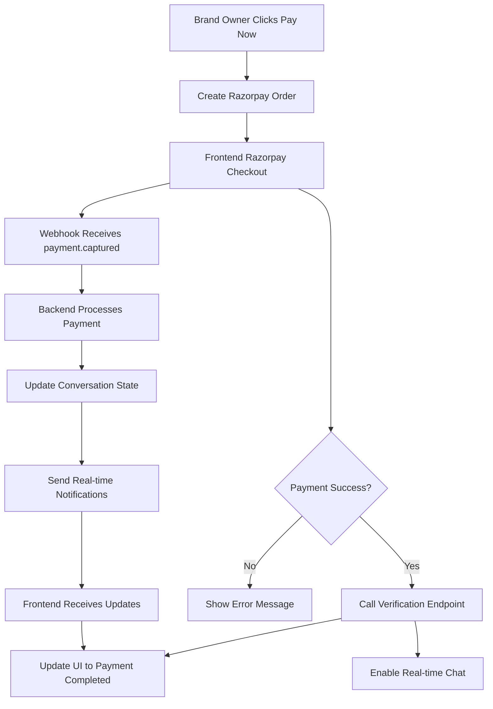

# Frontend Payment and Negotiation Flow Guide

## Overview

This guide provides complete implementation details for the frontend payment and negotiation flow, including automated conversations, real-time updates, and webhook handling.

## Table of Contents

1. [Payment Flow Architecture](#payment-flow-architecture)
2. [Negotiation Flow States](#negotiation-flow-states)
3. [API Endpoints](#api-endpoints)
4. [Real-time Updates](#real-time-updates)
5. [Webhook Handling](#webhook-handling)
6. [Error Handling](#error-handling)
7. [Implementation Examples](#implementation-examples)

## Payment Flow Architecture

### Complete Payment Flow



### Key Components

1. **Payment Initiation**: Brand owner triggers payment
2. **Razorpay Integration**: Secure payment processing
3. **Verification**: Frontend calls backend verification
4. **Webhook Backup**: Backend processes webhook as fallback
5. **State Updates**: Real-time UI updates via WebSocket
6. **Escrow System**: Automatic fund holding until work completion

## Negotiation Flow States

### State Machine

```javascript
const NEGOTIATION_STATES = {
  // Initial states
  'influencer_responding': 'Influencer needs to respond to connection request',
  'brand_owner_details': 'Brand owner needs to provide project details',
  'influencer_price_response': 'Influencer needs to respond to price offer',
  'brand_owner_pricing': 'Brand owner needs to provide pricing',
  
  // Negotiation states
  'influencer_negotiating': 'Influencer is negotiating price',
  'brand_owner_negotiating': 'Brand owner is negotiating price',
  
  // Agreement states
  'price_agreed': 'Price has been agreed upon',
  'payment_pending': 'Payment is pending',
  'payment_completed': 'Payment completed, work can begin',
  
  // Work states
  'work_in_progress': 'Work is in progress',
  'work_submitted': 'Work has been submitted for review',
  'work_approved': 'Work has been approved',
  'work_revision_requested': 'Work revision requested',
  
  // Final states
  'collaboration_completed': 'Collaboration completed successfully',
  'collaboration_cancelled': 'Collaboration was cancelled'
};
```

### Awaiting Role

```javascript
const AWAITING_ROLES = {
  'influencer': 'Influencer needs to take action',
  'brand_owner': 'Brand owner needs to take action',
  null: 'No action required'
};
```

## API Endpoints

### 1. Initialize Bid Conversation

```javascript
// POST /api/bids/automated/initialize
const initializeBidConversation = async (bidId, influencerId, proposedAmount) => {
  const response = await fetch('/api/bids/automated/initialize', {
    method: 'POST',
    headers: {
      'Content-Type': 'application/json',
      'Authorization': `Bearer ${token}`
    },
    body: JSON.stringify({
      bid_id: bidId,
      influencer_id: influencerId,
      proposed_amount: proposedAmount
    })
  });
  
  return await response.json();
};
```

### 2. Handle Brand Owner Actions

```javascript
// POST /api/bids/automated/brand-owner-action
const handleBrandOwnerAction = async (conversationId, action, data = {}) => {
  const response = await fetch('/api/bids/automated/brand-owner-action', {
    method: 'POST',
    headers: {
      'Content-Type': 'application/json',
      'Authorization': `Bearer ${token}`
    },
    body: JSON.stringify({
      conversation_id: conversationId,
      action: action, // 'send_project_details', 'send_price_offer', 'proceed_to_payment', etc.
      data: data
    })
  });
  
  return await response.json();
};
```

### 3. Handle Influencer Actions

```javascript
// POST /api/bids/automated/influencer-action
const handleInfluencerAction = async (conversationId, action, data = {}) => {
  const response = await fetch('/api/bids/automated/influencer-action', {
    method: 'POST',
    headers: {
      'Content-Type': 'application/json',
      'Authorization': `Bearer ${token}`
    },
    body: JSON.stringify({
      conversation_id: conversationId,
      action: action, // 'accept_connection', 'reject_connection', 'accept_price', 'negotiate_price', etc.
      data: data
    })
  });
  
  return await response.json();
};
```

### 4. Verify Payment

```javascript
// POST /api/bids/automated/verify-payment
const verifyPayment = async (paymentData) => {
  const response = await fetch('/api/bids/automated/verify-payment', {
    method: 'POST',
    headers: {
      'Content-Type': 'application/json',
      'Authorization': `Bearer ${token}`
    },
    body: JSON.stringify({
      razorpay_order_id: paymentData.razorpay_order_id,
      razorpay_payment_id: paymentData.razorpay_payment_id,
      razorpay_signature: paymentData.razorpay_signature,
      conversation_id: paymentData.conversation_id
    })
  });
  
  return await response.json();
};
```

### 5. Get Conversation Context

```javascript
// GET /api/bids/automated/conversation/:conversation_id/context
const getConversationContext = async (conversationId) => {
  const response = await fetch(`/api/bids/automated/conversation/${conversationId}/context`, {
    headers: {
      'Authorization': `Bearer ${token}`
    }
  });
  
  return await response.json();
};
```

## Real-time Updates

### WebSocket Events

```javascript
// Connect to WebSocket
const socket = io('ws://your-backend-url', {
  auth: {
    token: userToken
  }
});

// Listen for conversation updates
socket.on('conversation_updated', (data) => {
  console.log('Conversation updated:', data);
  // Update UI with new conversation state
  updateConversationUI(data);
});

// Listen for new messages
socket.on('new_message', (data) => {
  console.log('New message:', data);
  // Add message to chat UI
  addMessageToChat(data.message);
});

// Listen for payment status updates
socket.on('payment_status_update', (data) => {
  console.log('Payment status updated:', data);
  // Update payment UI
  updatePaymentStatus(data);
});

// Listen for notifications
socket.on('notification', (data) => {
  console.log('Notification:', data);
  // Show notification to user
  showNotification(data);
});

// Join conversation room
socket.emit('join_conversation', { conversation_id: conversationId });

// Leave conversation room
socket.emit('leave_conversation', { conversation_id: conversationId });
```

### State Management

```javascript
// Conversation state management
class ConversationManager {
  constructor(conversationId) {
    this.conversationId = conversationId;
    this.state = {
      flow_state: null,
      awaiting_role: null,
      chat_status: 'automated',
      payment_completed: false,
      messages: []
    };
  }

  updateState(newState) {
    this.state = { ...this.state, ...newState };
    this.render();
  }

  render() {
    // Update UI based on current state
    this.updateFlowState();
    this.updateAwaitingRole();
    this.updateChatStatus();
    this.updatePaymentStatus();
  }

  updateFlowState() {
    const flowStateElement = document.getElementById('flow-state');
    if (flowStateElement) {
      flowStateElement.textContent = this.state.flow_state;
    }
  }

  updateAwaitingRole() {
    const awaitingRoleElement = document.getElementById('awaiting-role');
    if (awaitingRoleElement) {
      awaitingRoleElement.textContent = this.state.awaiting_role || 'None';
    }
  }

  updateChatStatus() {
    const chatStatusElement = document.getElementById('chat-status');
    if (chatStatusElement) {
      chatStatusElement.textContent = this.state.chat_status;
    }
  }

  updatePaymentStatus() {
    const paymentStatusElement = document.getElementById('payment-status');
    if (paymentStatusElement) {
      paymentStatusElement.textContent = this.state.payment_completed ? 'Completed' : 'Pending';
    }
  }
}
```

## Webhook Handling

### Webhook Configuration

```javascript
// Razorpay webhook configuration
const webhookConfig = {
  url: 'https://your-backend-url/webhook/razorpay',
  events: ['payment.captured'],
  secret: 'your-webhook-secret'
};
```

### Frontend Webhook Handling

```javascript
// Handle webhook-triggered updates
socket.on('payment_status_update', (data) => {
  if (data.status === 'completed') {
    // Payment completed via webhook
    showSuccessMessage('Payment completed successfully!');
    updateConversationState('payment_completed');
    enableRealTimeChat();
  }
});

// Fallback: Check for unprocessed payments
const checkUnprocessedPayments = async () => {
  try {
    const response = await fetch('/api/subscriptions/check-unprocessed-payments', {
      method: 'POST',
      headers: {
        'Authorization': `Bearer ${token}`
      }
    });
    
    const result = await response.json();
    if (result.success && result.results.processed > 0) {
      console.log('Processed unprocessed payments:', result.results.processed);
      // Refresh conversation state
      await refreshConversationState();
    }
  } catch (error) {
    console.error('Error checking unprocessed payments:', error);
  }
};
```

## Error Handling

### Payment Error Handling

```javascript
const handlePaymentError = (error) => {
  console.error('Payment error:', error);
  
  if (error.code === 'PAYMENT_CANCELLED') {
    showErrorMessage('Payment was cancelled. Please try again.');
  } else if (error.code === 'PAYMENT_FAILED') {
    showErrorMessage('Payment failed. Please check your payment details.');
  } else if (error.code === 'NETWORK_ERROR') {
    showErrorMessage('Network error. Please check your connection and try again.');
  } else {
    showErrorMessage('An unexpected error occurred. Please try again.');
  }
};
```

### Retry Mechanism

```javascript
const retryPayment = async (paymentData, maxRetries = 3) => {
  for (let attempt = 1; attempt <= maxRetries; attempt++) {
    try {
      const result = await verifyPayment(paymentData);
      if (result.success) {
        return result;
      }
    } catch (error) {
      console.error(`Payment verification attempt ${attempt} failed:`, error);
      
      if (attempt === maxRetries) {
        throw error;
      }
      
      // Wait before retry
      await new Promise(resolve => setTimeout(resolve, 1000 * attempt));
    }
  }
};
```

## Implementation Examples

### Complete Payment Component

```javascript
import React, { useState, useEffect } from 'react';
import { loadScript } from 'razorpay';

const PaymentComponent = ({ conversationId, amount, onPaymentSuccess, onPaymentError }) => {
  const [loading, setLoading] = useState(false);
  const [paymentData, setPaymentData] = useState(null);

  useEffect(() => {
    // Load Razorpay script
    loadScript('https://checkout.razorpay.com/v1/checkout.js');
  }, []);

  const handlePayment = async () => {
    try {
      setLoading(true);

      // Create Razorpay order
      const orderResponse = await fetch('/api/bids/automated/proceed-to-payment', {
        method: 'POST',
        headers: {
          'Content-Type': 'application/json',
          'Authorization': `Bearer ${token}`
        },
        body: JSON.stringify({
          conversation_id: conversationId
        })
      });

      const orderData = await orderResponse.json();
      if (!orderData.success) {
        throw new Error(orderData.message);
      }

      // Configure Razorpay options
      const options = {
        key: orderData.config.key_id,
        amount: orderData.payment_order.amount_paise,
        currency: orderData.payment_order.currency,
        name: 'Stoory',
        description: 'Collaboration Payment',
        order_id: orderData.payment_order.razorpay_order_id,
        handler: async (response) => {
          try {
            // Verify payment
            const verifyResponse = await verifyPayment({
              razorpay_order_id: response.razorpay_order_id,
              razorpay_payment_id: response.razorpay_payment_id,
              razorpay_signature: response.razorpay_signature,
              conversation_id: conversationId
            });

            if (verifyResponse.success) {
              onPaymentSuccess(verifyResponse);
            } else {
              onPaymentError(new Error(verifyResponse.message));
            }
          } catch (error) {
            onPaymentError(error);
          }
        },
        prefill: {
          name: user.name,
          email: user.email,
          contact: user.phone
        },
        notes: {
          conversation_id: conversationId
        },
        theme: {
          color: '#3399cc'
        }
      };

      // Open Razorpay checkout
      const razorpay = new window.Razorpay(options);
      razorpay.on('payment.failed', (response) => {
        onPaymentError(new Error('Payment failed'));
      });
      
      razorpay.open();

    } catch (error) {
      onPaymentError(error);
    } finally {
      setLoading(false);
    }
  };

  return (
    <div className="payment-component">
      <div className="payment-details">
        <h3>Payment Required</h3>
        <p>Amount: ₹{amount}</p>
        <p>Conversation ID: {conversationId}</p>
      </div>
      
      <button 
        onClick={handlePayment}
        disabled={loading}
        className="payment-button"
      >
        {loading ? 'Processing...' : 'Pay Now'}
      </button>
    </div>
  );
};

export default PaymentComponent;
```

### Negotiation Flow Component

```javascript
import React, { useState, useEffect } from 'react';
import io from 'socket.io-client';

const NegotiationFlow = ({ conversationId, userRole }) => {
  const [conversation, setConversation] = useState(null);
  const [messages, setMessages] = useState([]);
  const [loading, setLoading] = useState(false);
  const [socket, setSocket] = useState(null);

  useEffect(() => {
    // Initialize socket connection
    const newSocket = io('ws://your-backend-url', {
      auth: { token: userToken }
    });
    
    newSocket.emit('join_conversation', { conversation_id: conversationId });
    
    // Listen for updates
    newSocket.on('conversation_updated', handleConversationUpdate);
    newSocket.on('new_message', handleNewMessage);
    newSocket.on('payment_status_update', handlePaymentUpdate);
    
    setSocket(newSocket);
    
    // Load initial conversation state
    loadConversationState();
    
    return () => {
      newSocket.emit('leave_conversation', { conversation_id: conversationId });
      newSocket.disconnect();
    };
  }, [conversationId]);

  const loadConversationState = async () => {
    try {
      const response = await getConversationContext(conversationId);
      if (response.success) {
        setConversation(response.conversation);
        setMessages(response.messages || []);
      }
    } catch (error) {
      console.error('Error loading conversation state:', error);
    }
  };

  const handleConversationUpdate = (data) => {
    setConversation(prev => ({ ...prev, ...data }));
  };

  const handleNewMessage = (data) => {
    setMessages(prev => [...prev, data.message]);
  };

  const handlePaymentUpdate = (data) => {
    if (data.status === 'completed') {
      setConversation(prev => ({ 
        ...prev, 
        flow_state: 'payment_completed',
        payment_completed: true,
        chat_status: 'real_time'
      }));
    }
  };

  const handleAction = async (action, data = {}) => {
    try {
      setLoading(true);
      
      const response = userRole === 'brand_owner' 
        ? await handleBrandOwnerAction(conversationId, action, data)
        : await handleInfluencerAction(conversationId, action, data);
      
      if (response.success) {
        setConversation(response.conversation);
        if (response.message) {
          setMessages(prev => [...prev, response.message]);
        }
      } else {
        showErrorMessage(response.error);
      }
    } catch (error) {
      showErrorMessage('An error occurred. Please try again.');
    } finally {
      setLoading(false);
    }
  };

  const renderActionButtons = () => {
    if (!conversation || conversation.awaiting_role !== userRole) {
      return null;
    }

    const actions = getAvailableActions(conversation.flow_state, userRole);
    
    return (
      <div className="action-buttons">
        {actions.map(action => (
          <button
            key={action.id}
            onClick={() => handleAction(action.action, action.data)}
            disabled={loading}
            className={`action-button ${action.style}`}
          >
            {action.text}
          </button>
        ))}
      </div>
    );
  };

  const getAvailableActions = (flowState, role) => {
    const actionMap = {
      'influencer_responding': role === 'influencer' ? [
        { id: 'accept_connection', text: 'Accept Connection', action: 'accept_connection', style: 'primary' },
        { id: 'reject_connection', text: 'Reject Connection', action: 'reject_connection', style: 'danger' }
      ] : [],
      
      'brand_owner_details': role === 'brand_owner' ? [
        { id: 'send_project_details', text: 'Send Project Details', action: 'send_project_details', style: 'primary' }
      ] : [],
      
      'influencer_price_response': role === 'influencer' ? [
        { id: 'accept_price', text: 'Accept Price', action: 'accept_price', style: 'primary' },
        { id: 'negotiate_price', text: 'Negotiate Price', action: 'negotiate_price', style: 'secondary' }
      ] : [],
      
      'brand_owner_pricing': role === 'brand_owner' ? [
        { id: 'send_price_offer', text: 'Send Price Offer', action: 'send_price_offer', style: 'primary' }
      ] : [],
      
      'price_agreed': role === 'brand_owner' ? [
        { id: 'proceed_to_payment', text: 'Proceed to Payment', action: 'proceed_to_payment', style: 'primary' }
      ] : [],
      
      'payment_pending': role === 'brand_owner' ? [
        { id: 'pay_now', text: 'Pay Now', action: 'pay_now', style: 'primary' }
      ] : []
    };

    return actionMap[flowState] || [];
  };

  if (!conversation) {
    return <div>Loading conversation...</div>;
  }

  return (
    <div className="negotiation-flow">
      <div className="conversation-header">
        <h2>Negotiation Flow</h2>
        <div className="conversation-status">
          <span>State: {conversation.flow_state}</span>
          <span>Awaiting: {conversation.awaiting_role || 'None'}</span>
          <span>Chat: {conversation.chat_status}</span>
          {conversation.payment_completed && <span>Payment: Completed</span>}
        </div>
      </div>

      <div className="messages-container">
        {messages.map((message, index) => (
          <div key={index} className={`message ${message.sender_id === user.id ? 'sent' : 'received'}`}>
            <div className="message-content">
              {message.message}
            </div>
            {message.action_data && (
              <div className="message-actions">
                {message.action_data.buttons?.map(button => (
                  <button
                    key={button.id}
                    onClick={() => handleAction(button.action, button.data)}
                    className={`action-button ${button.style}`}
                  >
                    {button.text}
                  </button>
                ))}
              </div>
            )}
          </div>
        ))}
      </div>

      {renderActionButtons()}

      {conversation.flow_state === 'payment_pending' && (
        <PaymentComponent
          conversationId={conversationId}
          amount={conversation.flow_data?.agreed_amount}
          onPaymentSuccess={(result) => {
            console.log('Payment successful:', result);
            // Handle payment success
          }}
          onPaymentError={(error) => {
            console.error('Payment error:', error);
            // Handle payment error
          }}
        />
      )}
    </div>
  );
};

export default NegotiationFlow;
```

### Utility Functions

```javascript
// API utility functions
const apiCall = async (url, options = {}) => {
  const response = await fetch(url, {
    headers: {
      'Content-Type': 'application/json',
      'Authorization': `Bearer ${token}`,
      ...options.headers
    },
    ...options
  });

  if (!response.ok) {
    throw new Error(`HTTP error! status: ${response.status}`);
  }

  return await response.json();
};

// Notification utility
const showNotification = (message, type = 'info') => {
  // Implement your notification system
  console.log(`${type.toUpperCase()}: ${message}`);
};

const showSuccessMessage = (message) => {
  showNotification(message, 'success');
};

const showErrorMessage = (message) => {
  showNotification(message, 'error');
};

// Socket utility
const connectSocket = (token) => {
  return io('ws://your-backend-url', {
    auth: { token }
  });
};

// State management utility
const updateConversationState = (conversationId, updates) => {
  // Update local state
  setConversation(prev => ({ ...prev, ...updates }));
  
  // Emit to other components if needed
  window.dispatchEvent(new CustomEvent('conversationUpdated', {
    detail: { conversationId, updates }
  }));
};
```

## Testing

### Test Payment Flow

```javascript
// Test payment with Razorpay test cards
const testPaymentFlow = async () => {
  const testCards = {
    success: '4111 1111 1111 1111',
    failure: '4000 0000 0000 0002',
    network_error: '4000 0000 0000 9995'
  };

  // Use test cards for testing
  console.log('Test cards available:', testCards);
};
```

### Test Webhook

```javascript
// Test webhook endpoint
const testWebhook = async () => {
  try {
    const response = await fetch('/api/subscriptions/check-unprocessed-payments', {
      method: 'POST',
      headers: {
        'Authorization': `Bearer ${token}`
      }
    });
    
    const result = await response.json();
    console.log('Webhook test result:', result);
  } catch (error) {
    console.error('Webhook test error:', error);
  }
};
```

## Best Practices

1. **Always handle both verification and webhook paths**
2. **Implement proper error handling and retry mechanisms**
3. **Use WebSocket for real-time updates**
4. **Validate payment data before processing**
5. **Implement proper loading states**
6. **Handle network failures gracefully**
7. **Test with Razorpay test cards**
8. **Implement proper logging for debugging**

## Troubleshooting

### Common Issues

1. **Payment verification fails**: Check signature verification
2. **WebSocket not connecting**: Verify token and URL
3. **State not updating**: Check WebSocket event listeners
4. **Webhook not working**: Verify webhook URL and secret
5. **Duplicate payments**: Check existing transaction validation

### Debug Tools

```javascript
// Enable debug logging
const DEBUG = true;

const debugLog = (message, data) => {
  if (DEBUG) {
    console.log(`[DEBUG] ${message}`, data);
  }
};

// Debug conversation state
const debugConversationState = (conversation) => {
  debugLog('Conversation State:', {
    id: conversation.id,
    flow_state: conversation.flow_state,
    awaiting_role: conversation.awaiting_role,
    chat_status: conversation.chat_status,
    payment_completed: conversation.payment_completed
  });
};
```

This guide provides everything needed to implement the complete payment and negotiation flow on the frontend, including error handling, real-time updates, and webhook integration.
