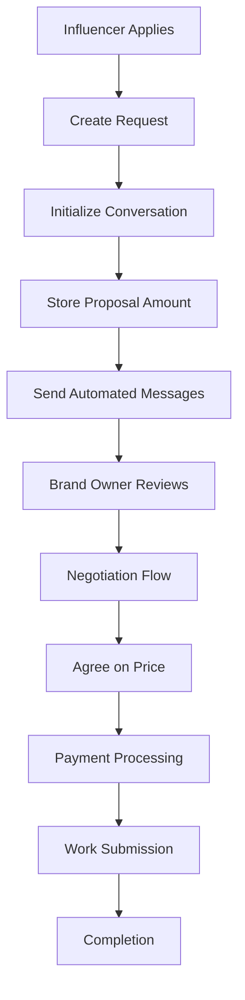

# 🎯 Influencer Request Flow Guide

## 📋 Overview

This guide explains how influencer requests are handled for bids and campaigns, including how proposal amounts are managed through the automated conversation flow.

---

## 🏗️ Current Architecture

### **Request Creation Flow**
1. **Influencer applies** → Creates `request` record with status `connected`
2. **Automated conversation** → Initializes conversation with proposal amount
3. **Negotiation flow** → Handles price negotiation through automated messages
4. **Payment flow** → Processes payments and updates request status

### **Key Components**
- **RequestController** - Handles initial request creation
- **AutomatedFlowService** - Manages conversation flow and proposal amounts
- **Conversation System** - Handles negotiation and messaging
- **Payment System** - Processes payments and wallet updates

---

## 🎯 BID REQUEST FLOW

### **1. Initial Request Creation**
```typescript
// Frontend sends:
POST /api/requests
{
  "bid_id": "849008b3-6d41-4ef6-83b2-faee1ba02233",
  "proposed_amount": 500,
  "message": "Interested in this bid",
  "timeline": "2 weeks",
  "portfolio_links": []
}
```

**What happens:**
1. ✅ Validates bid exists and is open
2. ✅ Checks if influencer already applied
3. ✅ Creates `request` record with status `connected`
4. ❌ **ISSUE**: `proposed_amount` and `message` are ignored (not stored)

### **2. Automated Conversation Initialization**
```typescript
// AutomatedFlowService.initializeBidConversation()
{
  bid_id: bidId,
  influencer_id: influencerId,
  proposed_amount: proposedAmount, // This should come from frontend
  status: 'connected',
  final_agreed_amount: parseFloat(proposedAmount), // Stores as final amount
  initial_payment: Math.round(parseFloat(proposedAmount) * 0.3 * 100) / 100,
  final_payment: Math.round(parseFloat(proposedAmount) * 0.7 * 100) / 100
}
```

**What happens:**
1. ✅ Creates conversation with automated flow
2. ✅ Stores proposal amount in `final_agreed_amount`
3. ✅ Calculates payment splits (30% initial, 70% final)
4. ✅ Sends automated messages to brand owner

---

## 🎯 CAMPAIGN REQUEST FLOW

### **1. Initial Request Creation**
```typescript
// Frontend sends:
POST /api/requests
{
  "campaign_id": "campaign-uuid",
  "proposed_amount": 1000,
  "message": "Interested in this campaign"
}
```

**What happens:**
1. ✅ Validates campaign exists and is open
2. ✅ Checks if influencer already applied
3. ✅ Creates `request` record with status `connected`
4. ❌ **ISSUE**: `proposed_amount` and `message` are ignored

### **2. Automated Conversation Initialization**
```typescript
// Similar to bid flow but for campaigns
{
  campaign_id: campaignId,
  influencer_id: influencerId,
  proposed_amount: proposedAmount,
  status: 'connected',
  final_agreed_amount: parseFloat(proposedAmount)
}
```

---

## 🔧 CURRENT ISSUES & SOLUTIONS

### **Issue 1: Proposal Amount Not Stored in Initial Request**
**Problem**: The `createRequest` method ignores `proposed_amount` from frontend.

**Current Code:**
```javascript
// Note: proposed_amount and message fields don't exist in requests table
// These will be handled through the conversation system
```

**Solution**: The proposal amount should be passed to the automated flow service.

### **Issue 2: Missing Connection Between Request and Conversation**
**Problem**: The request creation doesn't trigger conversation initialization.

**Current Flow:**
1. Request created ✅
2. Conversation NOT initialized ❌
3. Brand owner has to manually start conversation ❌

**Required Flow:**
1. Request created ✅
2. Conversation automatically initialized ✅
3. Proposal amount passed to conversation ✅
4. Automated messages sent to brand owner ✅

---

## 🛠️ REQUIRED FIXES

### **Fix 1: Update Request Creation to Initialize Conversation**

```javascript
// In RequestController.createRequest()
async createRequest(req, res) {
  // ... existing validation ...

  // Create request
  const { data: request, error } = await supabaseAdmin
    .from("requests")
    .insert(requestData)
    .select()
    .single();

  if (error) {
    return res.status(500).json({
      success: false,
      message: "Failed to create request",
      error: error.message,
    });
  }

  // NEW: Initialize automated conversation
  try {
    if (sourceType === "bid") {
      await automatedFlowService.initializeBidConversation(
        sourceId,
        userId,
        req.body.proposed_amount || 0
      );
    } else if (sourceType === "campaign") {
      await automatedFlowService.initializeCampaignConversation(
        sourceId,
        userId,
        req.body.proposed_amount || 0
      );
    }
  } catch (convError) {
    console.error("Failed to initialize conversation:", convError);
    // Don't fail the request creation, just log the error
  }

  // ... rest of the method
}
```

### **Fix 2: Add Campaign Conversation Initialization**

```javascript
// In AutomatedFlowService
async initializeCampaignConversation(campaignId, influencerId, proposedAmount) {
  // Similar to initializeBidConversation but for campaigns
  // Store proposal amount in final_agreed_amount
  // Create conversation with automated flow
  // Send initial messages to brand owner
}
```

### **Fix 3: Update Frontend Integration**

The frontend should:
1. Send `proposed_amount` in request creation
2. Handle the automated conversation flow
3. Display conversation messages and negotiation steps

---

## 📊 DATABASE SCHEMA

### **Requests Table**
```sql
CREATE TABLE requests (
    id UUID PRIMARY KEY DEFAULT uuid_generate_v4(),
    campaign_id UUID REFERENCES campaigns(id) ON DELETE CASCADE,
    bid_id UUID REFERENCES bids(id) ON DELETE CASCADE,
    influencer_id UUID NOT NULL REFERENCES users(id) ON DELETE CASCADE,
    status request_status DEFAULT 'connected',
    final_agreed_amount DECIMAL(10,2), -- Final price after negotiation
    initial_payment DECIMAL(10,2), -- 30% payment amount
    final_payment DECIMAL(10,2), -- 70% payment amount
    created_at TIMESTAMP WITH TIME ZONE DEFAULT NOW(),
    updated_at TIMESTAMP WITH TIME ZONE DEFAULT NOW()
);
```

**Note**: `proposed_amount` and `message` are NOT stored in requests table. They are handled through the conversation system.

### **Conversations Table**
```sql
CREATE TABLE conversations (
    id UUID PRIMARY KEY DEFAULT uuid_generate_v4(),
    campaign_id UUID REFERENCES campaigns(id) ON DELETE CASCADE,
    bid_id UUID REFERENCES bids(id) ON DELETE CASCADE,
    brand_owner_id UUID NOT NULL REFERENCES users(id) ON DELETE CASCADE,
    influencer_id UUID NOT NULL REFERENCES users(id) ON DELETE CASCADE,
    request_id UUID REFERENCES requests(id) ON DELETE CASCADE,
    flow_state TEXT DEFAULT 'initial',
    awaiting_role TEXT,
    flow_data JSONB, -- Stores negotiation history and amounts
    created_at TIMESTAMP WITH TIME ZONE DEFAULT NOW()
);
```

---

## 🔄 COMPLETE FLOW DIAGRAM



---

## 🎯 API ENDPOINTS

### **Request Creation**
```http
POST /api/requests
Content-Type: application/json
Authorization: Bearer <influencer_token>

{
  "bid_id": "uuid",
  "proposed_amount": 500,
  "message": "Interested in this bid",
  "timeline": "2 weeks",
  "portfolio_links": []
}
```

### **Conversation Actions**
```http
POST /api/bids/influencer-action
Content-Type: application/json
Authorization: Bearer <influencer_token>

{
  "conversation_id": "uuid",
  "action": "accept_price",
  "data": {
    "price": 500
  }
}
```

---

## 🚀 IMPLEMENTATION PRIORITY

### **High Priority**
1. ✅ Fix request creation error (completed)
2. 🔄 Update request creation to initialize conversation
3. 🔄 Add campaign conversation initialization
4. 🔄 Test complete flow end-to-end

### **Medium Priority**
1. Add proposal amount validation
2. Improve error handling
3. Add conversation state management
4. Add real-time updates

### **Low Priority**
1. Add analytics and tracking
2. Add notification improvements
3. Add UI/UX enhancements

---

## 📝 SUMMARY

**Current State**: Request creation works but doesn't initialize conversations or handle proposal amounts properly.

**Required Changes**:
1. Update `createRequest` to call automated flow service
2. Add campaign conversation initialization
3. Ensure proposal amounts are passed through the flow
4. Test complete end-to-end flow

**Result**: Influencers can apply with proposal amounts, conversations are automatically created, and the negotiation flow begins immediately.
